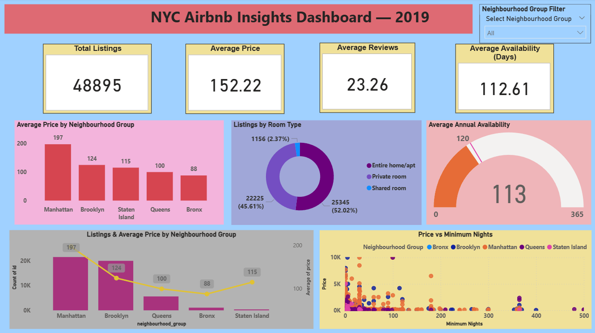

# 📊 NYC Airbnb Data Analytics – SkillAudit Internship

## 🚀 Project Overview

This repository contains my 4-week Data Analytics Internship project at SkillAudit, focused on analyzing the **NYC Airbnb Open Data (2019)** dataset.

The project follows an end-to-end data analytics workflow covering data cleaning, exploratory data analysis, SQL analysis, data visualization, dashboard development, and business insights.

The main objective of this project is to transform raw Airbnb listing data into meaningful insights related to **pricing, room types, availability, neighbourhood groups, and minimum-night requirements**.

### 🔄 Project Workflow

**Raw Data → Data Cleaning → Exploratory Data Analysis → SQL Analysis → Power BI Dashboard → Insights & Recommendations**

---

## 🎯 Project Objectives

- Clean and preprocess the NYC Airbnb dataset.
- Identify and handle missing values.
- Remove duplicate records.
- Validate important data fields.
- Perform Exploratory Data Analysis (EDA).
- Analyze Airbnb pricing across neighbourhood groups.
- Analyze room-type distribution.
- Analyze annual availability.
- Perform analytical queries using SQL and MySQL.
- Verify SQL results using Pandas.
- Build an interactive Power BI dashboard.
- Identify meaningful business insights.
- Provide actionable recommendations based on the analysis.

---

# 📅 WEEK 1 – Data Cleaning 🧹

The first week focused on preparing the NYC Airbnb dataset for further analysis.

### Tasks Performed

- Loaded the NYC Airbnb 2019 dataset using Python and Pandas.
- Inspected dataset dimensions and data types.
- Identified missing values.
- Handled missing `name` and `host_name` values.
- Handled missing `reviews_per_month` values.
- Handled missing `last_review` values.
- Converted `last_review` to datetime format.
- Converted identifier fields appropriately.
- Converted selected categorical fields to categorical data types.
- Removed exact duplicate records.
- Validated `availability_365` values between 0 and 365.
- Validated that `price` values were non-negative.
- Exported the cleaned dataset for further analysis.

### Dataset After Cleaning

- **Rows:** 48,895
- **Columns:** 16

### Technologies Used

- Python
- Pandas
- Jupyter Notebook

### Week 1 Files

- `Data_Cleaning.ipynb`
- `airbnb_nyc_2019_dataset_cleaned.csv`

---

# 📈 WEEK 2 – Exploratory Data Analysis

The second week focused on understanding the cleaned Airbnb dataset through statistical analysis and visualizations.

### Analysis Performed

- Average price by neighbourhood group
- Price distribution by room type
- Annual availability by room type
- Room-type distribution
- Neighbourhood-level price comparison
- Analysis of listing characteristics

### Key Questions Explored

1. How does Airbnb price vary across neighbourhood groups?
2. How does Airbnb price vary across different room types?
3. How does annual availability differ by room type?
4. Which neighbourhood groups have higher average prices?
5. What patterns can be observed in Airbnb listings?

### Visualizations

The analysis included:

- Bar charts
- Box plots
- Comparative visualizations
- Distribution analysis

### Technologies Used

- Python
- Pandas
- Matplotlib
- Jupyter Notebook

### Week 2 Files

- `Exploratory_Data_Analysis.ipynb`
- `EDA_summary.csv`

---

# 🗄️ WEEK 3 – SQL Analysis

The third week focused on analyzing the cleaned Airbnb dataset using SQL and a relational database.

The cleaned dataset was loaded into **MySQL** for analytical querying.

### Database Details

**Database:** `airbnb_analysis`

**Table:** `airbnb_listings`

**Records:** 48,895

### SQL Analysis

Ten analytical SQL queries were developed to investigate Airbnb listing patterns using:

- Aggregations
- `GROUP BY`
- `ORDER BY`
- Filtering
- Subqueries
- Comparative analysis
- Listing counts
- Average prices
- Room-type analysis
- Neighbourhood analysis

### Analysis Questions

The SQL analysis investigated questions such as:

- What is the average Airbnb price by neighbourhood group?
- How many listings are available for each room type?
- What is the average price by room type?
- How does availability vary across neighbourhood groups?
- Which neighbourhood groups have higher average prices?
- How are listings distributed across neighbourhoods?
- How do listing characteristics vary across the dataset?
- How do minimum-night requirements vary?
- Which neighbourhood groups have higher listing concentrations?
- Which listings have prices above the overall average?

SQL results were verified against Pandas-based analysis where applicable.

### Technologies Used

- SQL
- MySQL
- MySQL Workbench
- Python
- Pandas
- Jupyter Notebook

### Week 3 Files

- `SQL_Analysis.ipynb`
- `SQL_Queries.sql`
- `SQL_Sample_Output.csv`

---

# 📊 WEEK 4 – Insights Dashboard

The final week focused on transforming the analytical findings into an interactive business dashboard.

The dashboard was developed using **Microsoft Power BI Desktop**.

## 🖥️ NYC Airbnb Insights Dashboard – 2019



### Dashboard Components

The dashboard contains:

- Total Listings KPI
- Average Price KPI
- Average Reviews KPI
- Average Annual Availability KPI
- Average Price by Neighbourhood Group
- Listings by Room Type
- Average Annual Availability Gauge
- Listings & Average Price by Neighbourhood Group
- Price vs. Minimum Nights Scatter Plot
- Interactive Neighbourhood Group Filter

### Key Dashboard Metrics

| Metric | Value |
|---|---:|
| Total Listings | 48,895 |
| Average Price | 152.22 |
| Average Reviews | 23.26 |
| Average Annual Availability | 112.61 days |

---

# 💡 Key Insights

### 1. Manhattan Has the Highest Average Listing Price

Manhattan has the highest average listing price at approximately **196.88**, while the Bronx has the lowest average price at approximately **87.50**.

This shows that Airbnb pricing varies considerably across neighbourhood groups.

### 2. Entire Homes/Apartments Are the Largest Room-Type Category

Entire home/apt listings represent approximately **52.02%** of the listings, followed by private rooms at approximately **45.61%**.

Shared rooms represent a much smaller proportion of the listings.

### 3. Average Annual Availability Is Approximately 113 Days

The overall average annual availability is **112.61 days**, which is approximately **113 days**.

The dashboard uses **120 days as a project benchmark** for comparison.

### 4. Manhattan and Brooklyn Have High Listing Concentrations

The dashboard shows that Manhattan and Brooklyn contain substantially more listings than the other neighbourhood groups.

### 5. Minimum-Night Requirements Vary Across Listings

The scatter plot shows that minimum-night requirements vary considerably across Airbnb listings, with most listings concentrated at lower minimum-night values and a smaller number having substantially higher requirements.

---

# 📌 Recommendations

### 1. 🏙️ Neighbourhood-Based Pricing

Hosts should consider **neighbourhood-specific pricing strategies** because average listing prices differ considerably across NYC neighbourhood groups.

Pricing strategies can be adjusted according to local demand and market characteristics.

### 2. 🏠 Room-Type Optimization

Hosts should focus on improving **pricing, amenities, and listing presentation** for entire homes/apartments and private rooms, as these categories represent the majority of listings.

### 3. 📅 Availability Management

Hosts can analyze periods of lower booking activity and consider **flexible pricing, minimum-night requirements, and targeted promotions** to improve listing utilization.

---

# 🛠️ Technologies Used

| Technology | Purpose |
|---|---|
| Python | Data processing and analysis |
| Pandas | Data cleaning and manipulation |
| Matplotlib | Data visualization |
| Jupyter Notebook | Analysis environment |
| SQL | Analytical querying |
| MySQL | Relational database |
| MySQL Workbench | Database management |
| Power BI Desktop | Interactive dashboard |
| Git | Version control |
| GitHub | Project repository |

---

# 📁 Project Structure

```text
SkillAudit-Airbnb-Data-Cleaning/
│
├── WEEK-1/
│   ├── Data_Cleaning.ipynb
│   └── airbnb_nyc_2019_dataset_cleaned.csv
│
├── WEEK-2/
│   ├── EDA_summary.csv
│   └── Exploratory_Data_Analysis.ipynb
│
├── WEEK-3/
│   ├── SQL_Analysis.ipynb
│   ├── SQL_Queries.sql
│   └── SQL_Sample_Output.csv
│
├── WEEK-4/
│   ├── Airbnb_Insights_Dashboard.pbix
│   ├── Dashboard_Preview.png
│   └── Insights_Report.md
│
├── airbnb_nyc_2019_dataset_cleaned.csv
│
└── README.md
```

---

# 🔄 End-to-End Data Analytics Workflow

```text
NYC Airbnb Dataset
        ↓
Data Cleaning
        ↓
Data Validation
        ↓
Exploratory Data Analysis
        ↓
SQL Analysis
        ↓
Data Visualization
        ↓
Power BI Dashboard
        ↓
Insights & Recommendations
```

---

# 🎓 Internship Learning Outcomes
Through this 4-week project, I gained practical experience in:

* Data cleaning and preprocessing
* Missing-value handling
* Duplicate detection and removal
* Data validation
* Exploratory Data Analysis
* Statistical analysis
* Data visualization
* SQL querying
* MySQL database management
* Pandas-based data analysis
* Power BI dashboard development
* Business insight generation
* Data-driven recommendations
* End-to-end data analytics workflows

---

# 👩‍💻 About the Project

This project was completed as part of my SkillAudit Data Analytics Internship.

It provided hands-on experience in transforming raw NYC Airbnb listing data into structured information, identifying patterns in pricing, room types, availability, and neighbourhood groups, visualizing results, and communicating actionable insights through an interactive Power BI dashboard.

---

## ⭐ Conclusion

This project demonstrates an end-to-end approach to Data Analytics, combining Python, Pandas, SQL, MySQL, data visualization, and Power BI to transform NYC Airbnb listing data into meaningful insights.

The analysis provides insights into listing prices, room-type distribution, annual availability, neighbourhood groups, and minimum-night requirements, supporting data-driven decision making.

**Raw Data → Clean Data → Analysis → Visualization → Dashboard → Insights → Recommendations**
